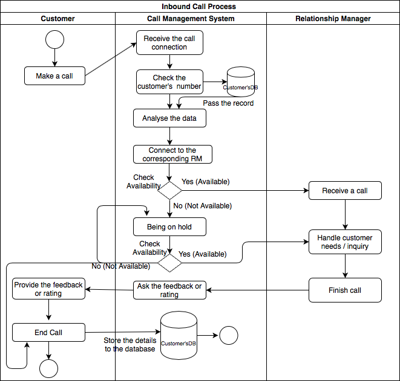
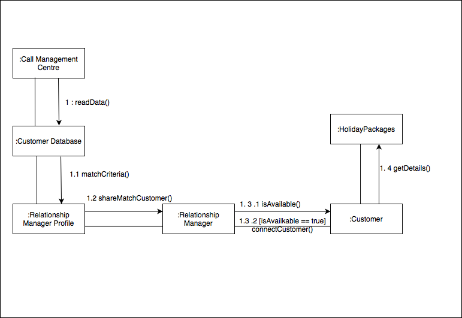

# TRAVEL COMPANY CALL MANAGEMENT CENTRE (CMC)

  ### Tutorial No: &emsp;5  
  ### Tutor Name:&ensp; Abdul Babar  
  ### Team Members: 
  * Ding Li Feng (13639277)
  * Haoxuan Zhang (13148933)
  * Walled Sahak (13873068)
  * Yanto Yanto (13133259)
  * Zeyang Zhou (13599814)
 

## Table of Contents 
- [Executive Summary:](#executive-summary)
- [Project Objectives:](#project-objectives)
  * [Objectives:](#objectives)
- [Stakeholders:](#stakeholders)
  * [Stakeholders Table:](#stakeholders-table)
  * [Stakeholders Diagram:](#stakeholders-diagram)
  * [Empathy Diagram:](#empathy-diagram)
- [Design Thinking Principles:](#design-thinking-principles)
- [Agile Methodology - Scrum:](#agile-methodology---scrum)
- [Assumptions:](#assumptions)
- [Point of Views (POV) Statements:](#point-of-views-pov-statements)
  * [Customer:](#customer)
  * [Relationship Manager (RM):](#relationship-manager-rm)
  * [Project Develop Team:](#project-develop-team)
  * [Travel Company:](#travel-company)
- [How Might We (HMW) Statements:](#how-might-we-hmw-statements)
- [User Stories:](#user-stories)
- [Wordproducts and Models:](#workproducts-and-models)
  * [Use Case Diagram:](#use-case-diagram)
    * [Call Management System:](#call-management-system)
    * [Use Case Narratives:](#use-case-narratives)
  * [Activity Diagram:](#activity-diagram)
    * [Inbound Call Process:](#inbound-call-process)
    * [Outbound Call Process:](#outbound-call-process)
  * [Class Diagram:](#class-diagram)
  * [Collaboration Diagram:](#collaboration-diagram)
    * [Inbound Call Process:](#inbound-call-process)
    * [Outbound Call Process:](#outbound-call-process)
- [Businesss User Analysis:](#business-user-analysis)
  * [Competitive Advantages:](#competitive-advantages)
  * [Possible Effects When Project Fails:](#possible-effects-when-project-fails)
- [Conclusion:](#conclusion)
 

 
## Executive Summary 

The purpose of this report is to outline, discuss and overcome the current problems and issues faced by the travel company, in regards to an information system for their in-house call management center (CMC). 

The primary objective of the project is to develop and implement an information system that adheres to all set constraints and meets the requirements of stakeholders and users to a satisfactory degree. The Agile Scrum methodology will be utilized during the completion of the project, development, and implementation of the proposed information system.

Various stakeholders will need to be considered during the completion of the project, ensuring the overall success of the project.
Understanding the perspective and goals of each stakeholder will be vital during the design and development phase, as clashing requirements will mandate what elements will be implemented and what elements will be exempt.

Various assumptions regrading the current system, as well as the proposed system have been made by the development team. These assumptions have been made from the perspectives of all stakeholders (Customers, Relationship Managers, and the Travel Company). 

Through utilization of various modelling techniques such as use case diagrams, activity diagrams and class diagrams, the effectiveness of the proposed system is outlined. Through the use of user stories, the perspective of various stakeholders on the proposed system is highlighted.

The competitive advantage of the proposed system is outlined and discussed. A multitude of factors should be considered during the development of an information system such as cost, timeframe, quality, and increased efficiency.

Although the report outlines and discusses the plethora of benefits that the travel company will gain due to the implementation of the proposed system, there are possible implications and effects if the project fails. Factors that this can affect include cost, time and security (data corruption).

## Problem Definition

### Objectives
The Purpose this report is to define the potential problems of the major travel company and help with developing information system which is for increasing the sales volume of travel package. And also, the final result and methods of development will be estimated and analysed 
according to various of methods.

The major travel company is facing the problem of the technique of information system. In more details, the calling system 
which is linked to end-customer and Relationship Managers (RM) needs to developed and implemented. In addition, the primary goal of the company is to increase profits, therefore the processes of customer service need to be improved. 

On the other hand, from the perspective of the company, the constraints of time and cost also need to be considered, parallel with risk management. A variety of preparation need to be considered once the development is having some trouble or not successful.

## Stakeholders
### Stakeholders Table 

***
### Stakeholders Diagram 

***
### Empathy Diagram
#### Relationship Manager

#### Customer

***

## Design Thinking Principles
From the perspective of design thinking principles, the solutions outlined in the discussion topic have the room for improvement. For instance, the company can do a customer survey, focusing on the hobbies and traits of customers. The customers who have done the survey will get a free gift package or voucher. Although this may increase cost, it will allow for attaining more data on the demands and interests of customers at differnt stages. After the survey is completed, the RM profile can be better applied. Also, the dataset of customer database will have more comprehensive expansion. On the other hand, it contains some biases on the part of inbound calls. The score may be affected due to some other elements (service attitude, calling connection etc.) Instead, the score mechanism can be developed more directly. For example, the staff can ask customers if they are  interested in particular packages or express elements  needed to be improved for the package. After that, the thought of customer will be recorded onto the database of customer interests.

## Agile Methodology - Scrum
The agile methodology is a project management process, which is mainly used for software development. In this process, customer needs and solutions are developed through the joint efforts of the company, the team, and the customer.
The travel company hopes to develop an information system that will provide the company with services and assistance to their customers. And the system will automatically help customers match travel plans suitable for customers. For example, when a company sells a specific travel package, the system automatically matches suitable customers. Match with Relationship Managers based on client's age, hobbies, etc. This makes it easier for RM to persuade customers to buy products. When company employees use the system, it only takes a very short time to match.

## Assumptions
* The relationship managers are using the CMC system to increase the sales effectively.
* The relationship manager will get feedback and ratings from customers every week to review and evaluate performance.
* The customer's input or details are confidential.
* The CMC system is implemented with the high secured system.
* The Relationship Manager (RM) will not be aware of which feedback and rating is assigned by which customers.
* The customer’s details on the system are only able to be accessed by the RM.
* The CMC system is trusted to handle large number or incoming calls.
* All incoming and outgoing calls are recorded and stored in the company database.

## Point of Views (POV) Statements 
### Customer 
* Customer needs to call the travel company because they want to acquire information regarding the holiday packages or book said package(s).
* Customers who are wondering about certain holiday packages, should be able to talk with the appropriate staff or RM because they would want to get the best answer from experts in that field/expertise.
### Relationship Manager (RM)
* RMs who offer the holiday packages need to implement an effective method to approach customers to increase sales.
* RM who wants to approach customers, need to acquire extensive details on customers to ensure their understanding on the customer preferences (favorites), needs and possible questions.
* RM who has communicated with customers should know their ratings and feedback, to ensure that they have a clear idea on their own weakness and strengths and complete set tasks the best of their abilities.
### Project Develop Team
* The project develop team needs to implement, test and maintain the system because they want to ensure that the system is ready to be used by the travel company staff and customer.
### Travel Company 
* The travel company needs to improve and mainstream the inbound and outbound call system to ensure that they provide the best customer service and assistance to their customers.
*  The travel company needs to assign the corresponding RM to customers because they want customers to be satisfied with answers/ solutions and offers that they have been provided with.
* The travel company needs to get feedback and ratings for their RMs because they would like to evaluate the service of the company and provide more training if need be, to ensure the highest degree of customer service is provided.

## How Might We (HMW) Statements 
* How might we match the RM with customers?
* How might we help the RMs get a higher understanding of their customers?
* How might we know the RM’s performance during their duties?
* How might we know what the customers feel/expect towards the service?
* How might we ensure that the customer’s questions and queries are answered to high degree?
 *How might we build the system to ensure that it can handle a large number of incoming calls?

## User Stories
| User Stories #| As a/an | I want to | So that | Estimates | Priority |
|:------------- | :------------- | :----------- | :----------- | :----------- | :----------- |
| 101 | Customer | Call the travel company easily | I can ask or book the holiday pacakage efficiently | 4 | High |
| 102 | Customer | Talk with the skilled and suitable employee | I can get the best answer from my question| 2 | High |
| 103 | Customer | Directly connect to the relationship manager | I do not need to wait on the call queue | 2 | Medium|
| 104 | Customer | Have a list with the company of my favourite holiday packages  | They can contact me whenever they offer the packages | 1 | Medium |
| 105 | Customer | Give feedback and ratings to the employee who I talked with | They can know how their perform | 2 | Low |
| 201 | Relationship Manager | Get the feedback or ratings from my customer | I can improve my customer service skill | 1 | Medium |
| 202 | Relationship Manager | Know my customer needs or details | I can serve the customer well and increase the sales | 2 | High |
| 203 | Relationship Manager | Get the customer list with their details | I can contact them and increase the sales | 2 | High |
| 204 | Relationship Manager | Store my skills and profile in the company | I can get directed with the customer based on my profile and skills | 4 | High |

## Workproducts and Models
### Use Case Diagram
***
  #### Call Management System
  
   As the diagram shown above, it shows how the CMC system works which customer and relationship manager take part of the system.
  The main stakeholders are the customer, relationship manager and CMC system.  The CMC system will take two main processes with sub-processes, customer take four main processes and relationship manager take four main processes as well   
 
#### Use Case Narratives
| Use Case ID | UC101 : Inbound Call Process |
|:------------- | :------------- |
| User Story | US102 : As a customer, I want to talk with the skilled and suitable employee so that I can get the best answer from my question | 
| Goal | Talk with the suitable relationship manager and get the answer  | 
| Actors | Primary Actor - Customer  Second Actor - Relationship Manager, Call Management System |
| Pre-conditions | The customer makes a call to the travel company | 
| Post-conditions | The customer has successfully connected with the suitable relationship manager | 
| Trigger | The customer has the question regarding to the holiday packages  | 
| Main Flow | 1. The customer make a call to the travel company.  2. The call management system from the travel company receives the call.  3. The system analyses the customer's number and matches it to the database.   4. The system will pass the call to the suitable relationship manager.   5. The relationship manager receives the call.   6. The relationship manager answers the customer questions and handle the customer's needs   7. The customer ends the call   8. The call system asks the customer to provide the feedback and rating.   9. The input is stored into the database.  10. Use case ends.| 
| Exceptions | Step 4-10 : the relationship manager is still on call with another customer. | 
| Includes | US101 : As a customer, I want to call the travel company easily so that I can ask or book the holiday pacakage efficiently  US103 : As a customer, I want to directly connect to the relationship manager so that I do not need to wait on the call queue    US105 : As a customer, I want to give feedback and ratings to the employee who I talked with so that they can know how their perform. |
| Supporting Information | The customer will be on call queue if the relationship manager is still on call with another customer.|
| Non-functional Requirements | Security: Only relationship manager can talk with the customer and all the details are confidental |

| Use Case ID | UC102 : Outbound Call Process |
|:------------- | :------------- |
| User Story | US203 : As a relationship manager, I want to get the customer list with their details so that I can contact them and increase the sales |
| Goal | Call the customer and increases the sales  | 
| Actors | Primary Actor - Relationship Manager  Second Actor - Customer, Call Management System |
| Pre-conditions | The relationship manager gets the customer list from the company's system | 
| Post-conditions | The relationship has successfully connected with the customer and offers the holiday packages | 
| Trigger | The relationship needs to increase the sales  | 
| Main Flow | 1. The call management system generates the customer details list.  2. The call management system  shares the list to the relationship manager.  3. The relationship manager receives the data.   4. The relationship manager makes a call to the customer.   5. The customer receives the call.  6. The relationship manager offers the holiday packages and provides the details.  7. The customer finishes the call  8. The call system asks the customer to provide the feedback and rating from the services.  9. The data input is stored into database.   10. Use case ends.| 
| Exceptions | Step 4-10 : the customer does not pick up the call. | 
| Includes | US201 : As a relationship manager, I want to get the feedback or ratings from my customer so that I can improve my customer service skill.  US 202 :As a relationship manager, I want to know my customer needs or details  so that I can serve the customer well and increase the sales |
| Supporting Information |  |
| Non-functional Requirements | Security: The customer details will be only accessible by the relationship manager |

### Activity Diagram
***
  #### Inbound Call Process
  
   As the diagram shown above, it shows the activity how the customer make a sequence call process to the relationship manager which needs the Call Management System as the platform or system to connect relationship manager.
  #### Outbound Call Process
  
   As the diagram shown above, it shows the activity how the relationship manager gets the customer's details and approach the customer to offer the holiday packages.

### Class Diagram
***
  
 The diagram above shows the objects or stakeholders which will be included on the system (review, employee, holiday package, booking, payment, customer and call history). Each objects or stakeholders has their own the properties and behaviour or methods to perform into this CMC system.
  
### Collaboration Diagram
***
  #### Inbound Call Process
  
   As the diagram shown above, it shows the process how the customer interacts with the relationship manager which needs to pass through some elements or processes. 
  #### Outbound Call Process
  
   As the diagram shown above, it shows the process how the call management centre generates the customer details list and send it to the suitable relationship managers. At the end of the process of this diagram, it will approach the customer and offer the holiday packages to them.
  
## Business User Analysis
  
  ### Competitive Advantages
  There are several Advantages when a new Information System implanted in the in-house call management system(CMC). The system machine's intervention will reduce many human resources and save the company a high cost in employment and management. The calling center is a substantial task workplace that could receive thousands of calling each day, the upgraded system allows the call management center differentiating different phone call and gaining information before staff answers calls from a customer, so the time will be reduced to the minimum and enquires be solved faster with all the prework has been done by the information system.
The significant advantage of the information system implantation, the calling center will be working more smoothly. This will provide more service time and less waiting time for customers, And it will also Improve relationship managers' performance and working time. This leads to better customer service, which will boost customer quantity and attraction, and higher sales of service packages and company profits.
Compare to other business's model, The proposed IS system will be operating smoothly and efficiently. At last, the advantage can be summarised as four significant points. Firstly,  increase customer' and buyers' service quality, which will boost customer quantity and attraction. Second of all, reduce company costs, less expenditure on employment and management. Thirdly, raise barriers to market entry And gain a process advantage to other businesses. Finally,  the upgraded to a new business model will be differentiating and enhancing products and services.
  
  ### Possible Effects When Project Fails
   The actual impact when an Infomation system fails when it is already implanted in the business could be enormous. However, when the project was first invented for the CMC, damage cost can be considered a minimal to the leading company.
There will be three possible effects that could happen once the project fails, first of all, will be financial costs. compare to other businesses, the financial cost will mainly be caused by reviving the customer details and employment costs to fixing the system. This will lead to secondary effects that are wasted time and human resources, because maintenance will require less employee. Resulting in project teams being small after the IS system is implanted for CMC. So when the project fails or has a significant problem it will require whole teams to fix. The last possible Effects could be missing or corrupted data in CMC, which is a critical problem that needs to be considered. to avoid this,  data should be kept safe and secure all the time.

 ### Conclusion  

Through the utilization of various modeling techniques, the design of the proposed system is outlined. Through an extensive analysis of the proposed system, various advantages of the system and risks of failure are highlighted.

## References 

Williams,P.2017.THE TRUE IMPACT OF IT FAILURES,https://www.codestone.net/our-thoughts/true-impact-of-it-failures/

anonymous，How Do Information Systems Provide Competitive Advantage?，https://sites.google.com/site/bus141wikisite/home/chapter-3-strategy-information-systems-and-competitive-advantag/how-do-information-systems-provide-competitive-

Porter,M,E,Millar,V,E.1985 How Information Gives You Competitive Advantage,https://hbr.org/1985/07/how-information-gives-you-competitive-advantage

Dam, R., Siang, T. 2019, ‘Stage 2 in the Design Think Process: Define the Problem and Interpret the Results’, Interaction Design    Foundation, November, viewed 20 May 2020, <https://www.interaction-design.org/literature/article/stage-2-in-the-design-thinking-process-define-the-problem-and-interpret-the-results>.

